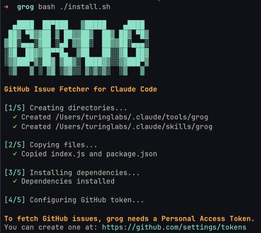

# GROG 🏴‍☠️

> *"Arr matey, fetch me that issue or walk the plank!"*

Because clicking through GitHub like a landlubber is for scallywags. Real pirates use the command line.

## What in Davy Jones' locker is this?

GROG is a CLI tool that fetches GitHub issues faster than you can say "shiver me timbers." It grabs issue titles, descriptions, and all that juicy metadata without ever leaving your beloved terminal.

Why is it called GROG? Because after debugging production issues at 3 AM, you'll need a drink. Also, **G**itHub **R**etrieving **O**perations **G**adget. *(We made up that acronym after naming it, obviously.)*

## Installation

### For Claude Code (Recommended)

Run the installer and prepare to witness ASCII art so majestic, it'll make your terminal weep tears of joy:

```bash
./install.sh
```



Behold, the five sacred steps of installation:

1. **Creating directories** - We make folders. Revolutionary, we know.
2. **Copying files** - `index.js` and `package.json` find their new home.
3. **Installing dependencies** - `npm install` but with ✓ checkmarks for dopamine.
4. **Configuring GitHub token** - Where you pretend you remember where you saved it.
5. **Victory** - You're now a certified GROG operator. Tell your mom.

This will:
- Install grog to `~/.claude/tools/grog`
- Create a `/grog` skill for Claude Code
- Ask for your GitHub token and store it securely
- Display the most beautiful ASCII art this side of the seven seas

Then in any Claude Code session:
```
/grog https://github.com/your/repo/issues/42
```

Or just paste a GitHub issue URL and Claude will fetch it automatically!

### Manual Installation

```bash
npm install -g grog

# Or if you're feeling rebellious:
yarn global add grog
```

Create a `.env` file with your GitHub token (guard it like buried treasure):

```env
GH_TOKEN=your_super_secret_token_here
```

## Standalone Usage

```bash
grog https://github.com/your/repo/issues/42
```

That's it. No flags. No options. No 47-page documentation. Just paste the URL and receive wisdom.

## What you get

```
📌 Issue #42: The answer to life, the universe, and everything
📊 State: open (because nothing is ever truly fixed)
👤 Author: some-dev-who-gave-up
📅 Created: 2024-01-15T03:00:00Z (3 AM, naturally)
🏷️  Labels: bug, help-wanted, crying-in-the-corner

The login button sometimes logs you out. Other times it orders pizza.
We're not sure which is the bug.
```

## Why GROG?

| Other Tools | GROG |
|-------------|------|
| Open browser | No browser needed |
| Click 47 times | One command |
| Wait for JS to load | Instant gratification |
| Get distracted by cat videos | Stay focused (mostly) |
| Feel productive | Actually be productive |

## Requirements

- Node.js (any version that doesn't make you cry)
- A GitHub token (free with any GitHub account, batteries not included)
- A burning desire to never leave the terminal

## Error Messages (A Feature, Not a Bug)

- **"No GitHub token found"** - You forgot the `.env` file. It happens to the best of us.
- **"Invalid GitHub issue URL"** - That's not an issue URL, that's your shopping list.
- **"No issue URL provided"** - You literally had one job.

## The GitHub Token Situation

Look, we need a Personal Access Token. Yes, another token. Yes, you'll forget where you put it in 3 days.

Get one at: https://github.com/settings/tokens

Required scopes:
- `repo` - To read issues (we promise we won't judge your code)
- That's it. We're not greedy.

Pro tip: Store your token somewhere safe. Not in a sticky note. Not in `passwords.txt`. We believe in you (barely).

## FAQ

**Q: Why not just use `gh issue view`?**
A: Because we didn't know that existed when we started this project. Also, branding.

**Q: Is this production-ready?**
A: It works on my machine. ¯\\\_(ツ)\_/¯

**Q: Can I contribute?**
A: Yes! We accept pull requests, issues, and emotional support.

**Q: Why is the code so simple?**
A: We believe in the KISS principle: Keep It Simple, Sailor.

**Q: Why is the ASCII art so... extra?**
A: Because if you're going to install a CLI tool, you deserve a *show*. We spent more time on the ASCII art than the actual code. No regrets.

**Q: The installer asked for my token and I panicked. What now?**
A: Run it again. We don't judge. The fifth time's the charm.

**Q: Can GROG fetch pull requests too?**
A: That sounds like a feature request. File an issue. We'll fetch it with GROG. It's the circle of life.

**Q: Why are there pirates in my terminal?**
A: You're asking the wrong questions, landlubber.

## Troubleshooting

### "ENOENT: no such file or directory"
You're in the wrong folder. Classic.

### "401 Unauthorized"
Your token is either wrong, expired, or you copy-pasted with an extra space. We've all been there.

### "The ASCII art looks weird"
Your terminal font doesn't support our artistic vision. That's a *you* problem.

### "It just... works?"
I know. We're as surprised as you are.

## Roadmap (Lies We Tell Ourselves)

- [ ] Fetch pull requests (coming Soon™)
- [ ] Support for GitLab (when someone pays us)
- [ ] Even bigger ASCII art (the people demand it)
- [ ] A GUI version (just kidding, we're not monsters)
- [ ] World domination (Q4 2025, maybe Q1 2026)

## Credits

- **The Pirate Theme**: Blame sleep deprivation
- **The ASCII Art**: Generated at 2 AM, refined at 3 AM, regretted at 9 AM
- **The Name "GROG"**: First thing we thought of. We committed to the bit.

## License

ISC - which stands for "I Sincerely Can't believe you read this far"

---

*Made with ☕ and questionable life choices*

*If this tool saved you 30 seconds, consider giving it a star. If it wasted your time, we're sorry (not really).*

```
    _____
   /     \
  | () () |
   \  ^  /
    |||||     "Arr, now go fetch some issues, ye scurvy developer!"
    |||||
```
